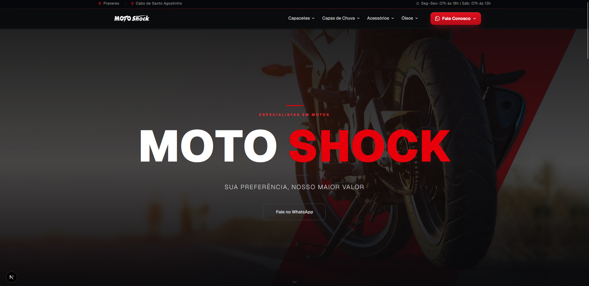

<div align="center">

# 🏍️ Motoshock

### _Especialistas em motos_

**Sua preferência, nosso maior valor.**

Landing page, loja e oficina — catálogo de capacetes, capas de chuva, acessórios e óleos, com atendimento direto via WhatsApp.

[](https://nextjs.org/)
[](https://www.typescriptlang.org/)
[](https://tailwindcss.com/)
[](https://vercel.com/)



</div>

---

## 📑 Sumário

- [Sobre o projeto](#-sobre-o-projeto)
- [Funcionalidades](#-funcionalidades)
- [Tecnologias](#️-tecnologias)
- [Estrutura de pastas](#-estrutura-de-pastas)
- [Começando](#-começando)
- [Scripts disponíveis](#-scripts-disponíveis)
- [Deploy](#️-deploy)
- [Autor](#-autor)

---

## 🧭 Sobre o projeto

O **Motoshock** é uma aplicação web para a empresa especializada em peças, acessórios e manutenção de motos em Pernambuco, com unidades em Prazeres (Jaboatão dos Guararapes) e Cabo de Santo Agostinho.

- 🛒 **Catálogo** — capacetes, capas de chuva, jaquetas, calças, luvas, botas e óleos
- 🔧 **Oficina** — manutenção, revisões e reparos com agendamento via WhatsApp
- 🚀 **Landing page** — vitrine institucional com identidade visual forte (preto + vermelho) e foco em conversão via WhatsApp

> Nenhum produto exibe preço — todo contato é feito diretamente pelo WhatsApp.

---

## ✨ Funcionalidades

- ✅ **Catálogo por categoria** — Capacetes, Capas de Chuva, Acessórios e Óleos com menus suspensos
- ✅ **Seleção de unidade** — usuário escolhe a loja preferida e todos os links WhatsApp respeitam a seleção
- ✅ **CTA direto pro WhatsApp** — todos os produtos redirecionam via `wa.me`
- ✅ **Design responsivo** — mobile-first, funciona bem em qualquer tela
- ✅ **Animações** — hero animado com GSAP, hover effects nos cards
- ✅ **Tipagem completa** com TypeScript de ponta a ponta

---

## 🛠️ Tecnologias

| Categoria | Stack |
|-----------|-------|
| **Framework** | Next.js 16 (App Router) |
| **UI** | React 19 + TypeScript 5 |
| **Estilização** | Tailwind CSS v4 + CSS inline |
| **Animações** | GSAP |
| **Estado** | React Context API + localStorage |
| **Dados** | Arquivos TypeScript em `lib/data/` |
| **Versionamento** | Git + GitHub |

---

## 📂 Estrutura de pastas

```
motoshock-site/
├── app/
│   ├── page.tsx                          # Homepage
│   ├── layout.tsx
│   └── catalogo/
│       └── acessorios/
│           ├── page.tsx
│           ├── capacetes/
│           ├── capas-de-chuva/
│           ├── oleos/
│           │   ├── oleo-motor/
│           │   ├── oleo-freio/
│           │   └── oleo-suspensao/
│           └── [tipo]/                   # Jaquetas, Calças, Luvas, Botas
├── components/
│   ├── Navbar.tsx
│   ├── Footer.tsx
│   ├── ConsultorCard.tsx
│   ├── HeroGsap.tsx
│   └── SelecionarUnidade.tsx
├── lib/
│   ├── context/unidade.tsx
│   ├── data/
│   │   ├── empresa.ts
│   │   ├── acessorios.ts
│   │   └── marcas.ts
│   └── utils.ts
├── public/Imagens/
├── next.config.ts
└── tsconfig.json
```

---

## 🚀 Começando

### Pré-requisitos

- [Node.js](https://nodejs.org/) **18.17+**
- `npm`, `yarn` ou `pnpm`

### Instalação

```bash
git clone https://github.com/kibedev/motoshock-site.git
cd motoshock-site
npm install
npm run dev
```

Acesse [http://localhost:3000](http://localhost:3000).

---

## 📜 Scripts disponíveis

| Comando | Descrição |
|---------|-----------|
| `npm run dev` | Servidor de desenvolvimento em `localhost:3000` |
| `npm run build` | Build de produção |
| `npm run start` | Executa a build localmente |
| `npx tsc --noEmit` | Verificação de tipos |

---

## ☁️ Deploy

Recomendado via [Vercel](https://vercel.com/):

1. Importe o repositório em [vercel.com/new](https://vercel.com/new)
2. Deploy automático a cada `push` na branch `main`

---

## 👤 Autor

**kibedev**

- GitHub: [@kibedev](https://github.com/kibedev)
- Repositório: [motoshock-site](https://github.com/kibedev/motoshock-site)

---

<div align="center">

Feito com ☕ e 🏍️ por [kibedev](https://github.com/kibedev)

</div>
